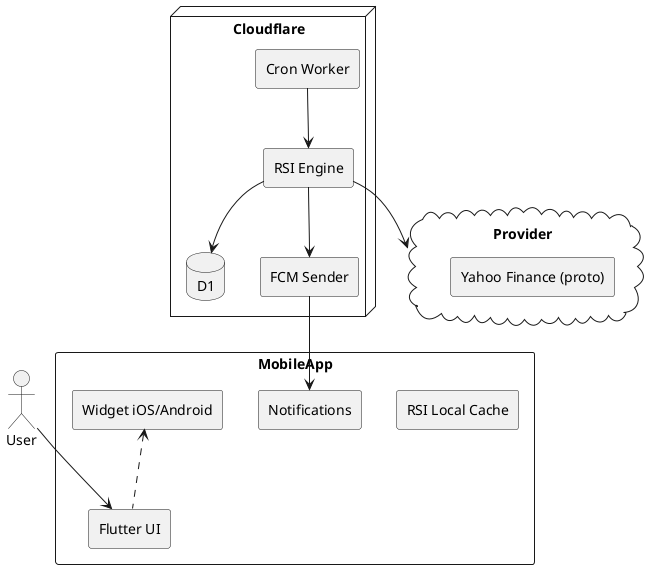

# SPEC-1—RSI Alert/Widget Application

## Background

You need a mobile application that:
- Shows only an RSI chart for the selected instrument (stocks, crypto, FX, etc.).
- Sends notifications when RSI crosses predefined levels (for example, 30/70 or user-defined thresholds).
- Works autonomously (self-sustained), ideally exposed as a widget on the phone’s home screen.

Initial assumptions (to validate together):
- Unified codebase for iOS and Android.
- Market data sourced from public APIs with minute/hour/day candles.
- Alerts must fire even when the app is not in the foreground.

## Requirements

### Domain scope
- **Assets (Must):** cryptocurrencies (major spot pairs), equities (primary US markets), forex majors.
- **Data (Must):** historical and live candles (1m/5m/15m/1h/4h/1d). At least 500–1000 recent candles to compute RSI reliably.
- **RSI (Must):** classic RSI(14) plus custom period and levels (e.g., 20/80, 30/70, 50).
- **Alerts (Must):** level cross up/down, one-shot or recurring, silent/loud modes.
- **Widgets (Should):** iOS/Android widgets with mini RSI sparkline and zone coloring.
- **Background execution (Must):** automated checks without opening the app; push notifications.
- **Cross-platform (Should):** single codebase for iOS and Android.
- **Data budget (Must):** rely on free or low-cost providers; minimize quota usage.
- **UX (Should):** fast instrument switching, RSI level presets, dark theme.
- **Reliability (Should):** debounce around thresholds (hysteresis), deduplicate alerts.
- **Privacy (Must):** no trading keys; only public market data.

### Preliminary data sources (cost optimized)
- **Crypto (Must):** public OHLC endpoints from exchanges:
  - Binance (REST `/klines`, generous limits; no key required for market data).
  - Kraken (REST `/public/OHLC`, up to ~720 rows per request).
- **Stocks (Should → Must for US):** Alpha Vantage (free, ~25 calls/day per key) plus Twelve Data Basic (free ~8 req/min and ~800/day) as alternative/fallback.
- **Forex (Must):** Twelve Data Basic or Alpha Vantage FX depending on limits and latency.

> Note: exact limits and legal terms will be handled in the “Method” section with caching and request queuing.

### Non-functional (MoSCoW)
- **Must:**
  - Average alert latency ≤ 1–2 minutes for timeframes ≥ 1m.
  - Operates with the app minimized.
  - Localization RU/EN.
- **Should:**
  - Store 30–90 days of local RSI history for charting.
  - Import/export alert profiles.
- **Could:**
  - Cloud sync across devices.
  - Backtest: replay alerts for the last month.
- **Won’t (MVP):**
  - Trading, portfolio, options.
  - Server-side aggregation of paid data feeds.


## Method

### Architecture (MVP—reliable alerts, low maintenance)

- **Client (Flutter):** single iOS/Android codebase; charting engine (`flutter_charts`/`syncfusion_flutter_charts`), local cache (SQLite/`isar`).
- **Widgets:**
  - **iOS:** WidgetKit (micro timelines). Refresh triggered via push signal that regenerates the timeline.
  - **Android:** AppWidget (Jetpack Glance/RemoteViews). Scheduled refresh (OS limits) plus push-triggered forced refresh.
- **Backend (lightweight and affordable):**
  - **Cloudflare Workers + Cron Triggers** ($0–$5/month on Free/Workers Paid). Periodic polling of APIs, RSI calculation for active rules, configuration stored in **Cloudflare D1** (SQLite) or **KV**, push delivery through **Firebase Cloud Messaging (FCM)**.
  - Alternatives: **Vercel Cron + Serverless Functions** or **AWS Lambda + EventBridge** (possible free tier).
- **Data sources (prototype):**
  - **Stocks/FX:** Yahoo Finance (`YahooProtoSource` adapter), symbols like `AAPL`, `MSFT`, pairs `EURUSD=X`, `GBPUSD=X`.
- **Why a lightweight backend is required:** to keep latency within 1–2 minutes, client widgets/background jobs are insufficient (iOS/Android impose tight limits). The backend handles frequent polling and dispatches push notifications.

### Widget design (RSI dashboard)

**Goal:** fit as many “instrument tiles” as possible, each showing an RSI mini-chart and the current value.

**Platform constraints:**
- **iOS (WidgetKit):** fixed sizes (small/medium/large). Minimal scrolling/interactivity. Ten columns do not fit physically; 2–4 columns are realistic depending on size and device.
- **Android (AppWidget):** user-defined size; can approach 10 columns on wide screens/tablets. On phones expect 3–5 columns.

**Compromise:** adaptive grid with minimum tile width `TileMinWidth` and auto column count: `cols = floor(widgetWidth / TileMinWidth)`.

**Instrument tile (minimal):**
- Ticker label in the top-left (short, e.g., `AAPL`).
- RSI value large (integer/one decimal).
- RSI mini sparkline (last 30–50 points) in the background.
- Zone indicator: below lower bound / between bounds / above upper bound (icon/marker).
- Color coding: below lower bound → cool, above upper bound → warm, between → neutral.

**Grid targets:**
- **iOS Small:** up to 2×2 tiles (4 instruments).
- **iOS Medium:** 3×2 or 4×2 (6–8 instruments) depending on device.
- **iOS Large:** 4×3 (12 instruments).
- **Android:** adaptive; 4–5 columns × 3–4 rows on phones, 8–10 columns on tablets.

**Multiple widgets:** users can add several widget instances (different instrument sets) to effectively emulate “10 columns” across rows on the home screen.

**Widget payload:**
- Snapshot at timeline generation: `symbol`, `rsi`, `sparkline[]`, `zone`, `updatedAt`.
- iOS: timeline covering 60–90 minutes, regenerated via push.
- Android: refresh through `AppWidgetManager` on push/schedule.

**Performance:**
- Generate the sparkline on the backend as a mini PNG/SparklinePath (compressed) to reduce widget rendering cost.
- Limit sparkline points (e.g., 32–48), round RSI to one decimal.

**Tile view model:**
```json
{
  "symbol": "AAPL",
  "rsi": 68.4,
  "zone": "above", // below|between|above
  "levels": [30, 70],
  "sparkline": [55,56,58,60,63,65,64,66,68,67,68,69,70,69,68,67,68,69,71,70,69,68,67,66,65,66,67,68,68,69,70,68],
  "timeframe": "15m",
  "updatedAt": 1730000000
}
```

### Data flow

> Prototype mode: **Yahoo-only for stocks/FX**. Yahoo adapter enabled, other providers disabled. Switching to Twelve Data/crypto is a configuration flag.

1. User creates an alert rule (instrument, timeframe, RSI period, level(s), crossing type, quiet zone).
2. The rule is stored in D1/KV and marked active.
3. Cron Worker runs on a schedule (e.g., every minute for 1m/5m; every 5 minutes for 15m+):
   - Pulls missing candles from Yahoo.
   - Updates the price/RSI cache; checks crossings with hysteresis.
   - On trigger, records an event and sends FCM (device tokens).
4. Client receives the push, logs the event locally, updates chart/widget.

### RSI algorithm (Wilder’s RSI)
- Period configured by the user (default 14).
- Formulas:
  - `U_t = max(0, Close_t - Close_{t-1})`, `D_t = max(0, Close_{t-1} - Close_t)`
  - `AU_t = (AU_{t-1}*(n-1) + U_t)/n`, `AD_t = (AD_{t-1}*(n-1) + D_t)/n`
  - `RS_t = AU_t / AD_t` (if `AD_t = 0`, RSI = 100)
  - `RSI_t = 100 - 100/(1 + RS_t)`
- For the initial point, AU/AD are the averages over the first n steps.
- Cache AU/AD values for incremental updates.

### Trigger logic
- Types: `CrossUp(level)`, `CrossDown(level)`, `EnterZone([lo, hi])`, `ExitZone([lo, hi])`.
- **Anti-chatter:** hysteresis `±δ` (e.g., 0.5 RSI), cooldown of N minutes, deduplicate per bar.

### Data model (D1/SQLite)
```sql
CREATE TABLE instrument (
  id TEXT PRIMARY KEY,
  type TEXT NOT NULL,          -- stock|fx
  provider TEXT NOT NULL,      -- YF_PROTO (later BINANCE|KRAKEN|TWELVE)
  symbol TEXT NOT NULL
);

CREATE TABLE device (
  id TEXT PRIMARY KEY,
  user_id TEXT NOT NULL,
  fcm_token TEXT NOT NULL,
  platform TEXT NOT NULL,
  created_at INTEGER NOT NULL
);

CREATE TABLE alert_rule (
  id TEXT PRIMARY KEY,
  user_id TEXT NOT NULL,
  instrument_id TEXT NOT NULL,
  timeframe TEXT NOT NULL,
  rsi_period INTEGER NOT NULL DEFAULT 14,
  levels TEXT NOT NULL,
  mode TEXT NOT NULL,
  hysteresis REAL NOT NULL DEFAULT 0.5,
  cooldown_sec INTEGER NOT NULL DEFAULT 600,
  active INTEGER NOT NULL DEFAULT 1,
  created_at INTEGER NOT NULL
);

CREATE TABLE alert_state (
  rule_id TEXT PRIMARY KEY,
  last_rsi REAL,
  last_bar_ts INTEGER,
  last_fire_ts INTEGER,
  last_side TEXT
);

CREATE TABLE alert_event (
  id TEXT PRIMARY KEY,
  rule_id TEXT NOT NULL,
  ts INTEGER NOT NULL,
  rsi REAL NOT NULL,
  level REAL,
  side TEXT,
  bar_ts INTEGER
);
```

### Components (PlantUML)


## Implementation

### Minimal starter kit—for immediate use in Cursor

#### 1) Flutter (Dart)—minimal `pubspec.yaml`
```yaml
name: rsi_widget
environment:
  sdk: ">=3.3.0 <4.0.0"
dependencies:
  flutter: { sdk: flutter }
  flutter_local_notifications: ^17.2.1
  firebase_core: ^3.6.0
  firebase_messaging: ^15.1.2
  http: ^1.2.2
  isar: ^3.1.0+1
  isar_flutter_libs: ^3.1.0+1
  freezed_annotation: ^2.4.4
  json_annotation: ^4.9.0
  fl_chart: ^0.68.0
  # add an iOS WidgetKit bridge later (meta-project)
dev_dependencies:
  flutter_test: { sdk: flutter }
  build_runner: ^2.4.11
  freezed: ^2.5.7
  json_serializable: ^6.9.0
```

#### 2) Models (Isar) and RSI function (Dart)
`lib/models.dart`
```dart
import 'package:isar/isar.dart';
part 'models.g.dart';

@collection
class AlertRule {
  Id id = Isar.autoIncrement;
  late String symbol;         // e.g. AAPL, EURUSD=X
  late String timeframe;      // 1m|5m|15m|1h|4h|1d
  int rsiPeriod = 14;
  List<double> levels = [30,70];
  String mode = 'cross';      // cross|enter|exit
  double hysteresis = 0.5;
  int cooldownSec = 600;
  bool active = true;
}

@collection
class AlertState {
  Id id = Isar.autoIncrement;
  late int ruleId;
  double? lastRsi;
  int? lastBarTs;
  int? lastFireTs;
  String? lastSide;           // above|below|between
}

@collection
class AlertEvent {
  Id id = Isar.autoIncrement;
  late int ruleId;
  late int ts;
  late double rsi;
  double? level;
  String? side;
  int? barTs;
  late String symbol;
}

/// Wilder RSI incremental update
class RsiState { double au; double ad; RsiState(this.au, this.ad); }

double? computeRsi(List<double> closes, int n) {
  if (closes.length < n + 1) return null;
  double gain = 0, loss = 0;
  for (var i = 1; i <= n; i++) {
    final ch = closes[i] - closes[i-1];
    if (ch > 0) gain += ch; else loss -= ch;
  }
  double au = gain / n, ad = loss / n;
  double rs = ad == 0 ? double.infinity : au / ad;
  double rsi = 100 - (100 / (1 + rs));
  for (var i = n + 1; i < closes.length; i++) {
    final ch = closes[i] - closes[i-1];
    final u = ch > 0 ? ch : 0.0;
    final d = ch < 0 ? -ch : 0.0;
    au = (au * (n - 1) + u) / n;
    ad = (ad * (n - 1) + d) / n;
    rs = ad == 0 ? double.infinity : au / ad;
    rsi = 100 - (100 / (1 + rs));
  }
  return rsi.clamp(0, 100);
}
```

#### 3) YahooProto client (HTTP wrapper)
`lib/yahoo_proto.dart`
```dart
import 'dart:convert';
import 'package:http/http.dart' as http;

class YahooProtoSource {
  final String endpoint; // Workers proxy: /yf/candles
  YahooProtoSource(this.endpoint);

  Future<List<List<num>>> fetchCandles(String symbol, String tf, {int? since}) async {
    final uri = Uri.parse('$endpoint?symbol=$symbol&tf=$tf&since=${since ?? ''}');
    final r = await http.get(uri, headers: { 'accept': 'application/json' });
    if (r.statusCode != 200) { throw Exception('YF $symbol $tf ${r.statusCode}'); }
    final data = json.decode(r.body) as List;
    // expected format: [[ts, open, high, low, close, volume], ...]
    return data.map((e) => (e as List).cast<num>()).toList();
  }
}
```

#### 4) Simple RSI chart (fl_chart)
`lib/rsi_chart.dart`
```dart
import 'package:fl_chart/fl_chart.dart';
import 'package:flutter/widgets.dart';

class RsiChart extends StatelessWidget {
  final List<double> rsi;
  final List<double> levels;
  const RsiChart({super.key, required this.rsi, this.levels = const [30,70]});

  @override
  Widget build(BuildContext context) {
    final spots = [for (int i=0;i<rsi.length;i++) FlSpot(i.toDouble(), rsi[i])];
    return LineChart(LineChartData(
      minY: 0, maxY: 100,
      gridData: FlGridData(show: true),
      titlesData: FlTitlesData(show: false),
      lineBarsData: [LineChartBarData(spots: spots, isCurved: false)],
      extraLinesData: ExtraLinesData(horizontalLines: [
        for (final l in levels) HorizontalLine(y: l, strokeWidth: 1),
      ]),
    ));
  }
}
```

#### 5) Cloudflare Workers—minimal project
`wrangler.toml`
```toml
name = "rsi-workers"
main = "src/index.ts"
compatibility_date = "2024-10-01"
[triggers]
crons = ["*/1 * * * *"]
[[kv_namespaces]]
binding = "KV"
id = "<your-kv-id>"
[[d1_databases]]
binding = "DB"
database_name = "rsi-db"
id = "<your-d1-id>"
```

`src/index.ts`
```ts
import { Hono } from 'hono';
import { cors } from 'hono/cors';

export interface Env { KV: KVNamespace; DB: D1Database; FCM_KEY: string; }
const app = new Hono<{ Bindings: Env }>();
app.use('*', cors());

// Proxy for YahooProto (minimal; replace with a licensed source before production)
app.get('/yf/candles', async (c) => {
  const { symbol, tf, since } = c.req.query();
  // TODO: pull from an unofficial YF source or KV cache; return [[ts,o,h,l,c,v],...]
  // Placeholder: read from KV
  const key = `yf:${symbol}:${tf}`;
  const cached = await c.env.KV.get(key);
  if (cached) return c.text(cached, 200);
  return c.json([]);
});

// Cron job: poll YF, compute RSI, send FCM
export default {
  fetch: app.fetch,
  scheduled: async (event: ScheduledEvent, env: Env, ctx: ExecutionContext) => {
    // 1) fetch active rules from D1
    // 2) group by symbol/tf, fetch missing candles
    // 3) compute RSI and evaluate crossings
    // 4) on trigger—send FCM
  }
}
```

Sending FCM (minimal):
`src/fcm.ts`
```ts
export async function sendFcm(fcmKey: string, token: string, data: Record<string,string>) {
  const r = await fetch('https://fcm.googleapis.com/fcm/send', {
    method: 'POST',
    headers: { 'Authorization': `key=${fcmKey}`, 'Content-Type': 'application/json' },
    body: JSON.stringify({ to: token, data })
  });
  if (!r.ok) throw new Error(`FCM ${r.status}`);
}
```
> For production use **HTTP v1** with a service account; this is the bare minimum for a prototype.

#### 6) D1—table creation (minimal)
`schema.sql`
```sql
CREATE TABLE IF NOT EXISTS alert_rule (
  id INTEGER PRIMARY KEY AUTOINCREMENT,
  user_id TEXT NOT NULL,
  symbol TEXT NOT NULL,
  timeframe TEXT NOT NULL,
  rsi_period INTEGER NOT NULL DEFAULT 14,
  levels TEXT NOT NULL,
  mode TEXT NOT NULL,
  hysteresis REAL NOT NULL DEFAULT 0.5,
  cooldown_sec INTEGER NOT NULL DEFAULT 600,
  active INTEGER NOT NULL DEFAULT 1,
  created_at INTEGER NOT NULL
);

CREATE TABLE IF NOT EXISTS alert_state (
  rule_id INTEGER PRIMARY KEY,
  last_rsi REAL,
  last_bar_ts INTEGER,
  last_fire_ts INTEGER,
  last_side TEXT
);

CREATE TABLE IF NOT EXISTS device (
  id TEXT PRIMARY KEY,
  user_id TEXT NOT NULL,
  fcm_token TEXT NOT NULL,
  platform TEXT NOT NULL,
  created_at INTEGER NOT NULL
);

CREATE TABLE IF NOT EXISTS alert_event (
  id INTEGER PRIMARY KEY AUTOINCREMENT,
  rule_id INTEGER NOT NULL,
  ts INTEGER NOT NULL,
  rsi REAL NOT NULL,
  level REAL,
  side TEXT,
  bar_ts INTEGER,
  symbol TEXT
);
```

#### 7) ENV/secrets
- Workers: `FCM_KEY=<legacy-server-key-or-use-httpv1>`, `PROVIDER_STOCKS_FX=YF_PROTO`.
- Client: Firebase config (iOS/Android), `WORKERS_ENDPOINT=https://<your-worker>/`.

#### 8) Mini checklist
- [ ] Create a Firebase project, enable Cloud Messaging, add iOS/Android apps.
- [ ] Provision D1 and KV, apply `schema.sql`.
- [ ] Deploy Workers (`wrangler publish`).
- [ ] In the client: input RSI period, levels, timeframe; rules screen; RSI chart rendering.
- [ ] Receive pushes (FCM), persist in Isar, refresh widget.
- [ ] Cron ticks every minute, logs show rule processing.

#### 9) API samples (for debugging)
```bash
# Force refresh (if you add a handler)
curl -X POST https://<worker>/refresh -d '{"symbols":["AAPL","EURUSD=X"],"tf":"15m"}' -H 'content-type: application/json'

# Read cached candles (demo)
curl "https://<worker>/yf/candles?symbol=AAPL&tf=15m"
```

#### 10) Widget tile sizing
- Minimum tile width `TileMinWidth` ≈ 56–72dp (device-dependent), giving **3–5 columns** on a phone; more on tablets. Multiple widget instances help show additional instruments.

---
This is the “skeleton” that a Cursor agent can evolve into a production-ready application.

