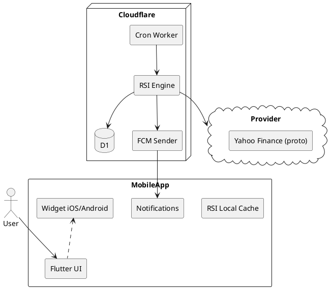

# SPEC-1—Приложение RSI/Виджет оповещений

## Background

Вы хотите мобильное приложение, которое:
- Показывает только график RSI выбранного инструмента (акции, крипто, FX и т.п.).
- Присылает уведомления при пересечении заданных уровней RSI (например, 30/70 или пользовательские уровни).
- Работает автономно («сам»), желательно в формате виджета на экране телефона.

Предварительные предположения (уточним вместе):
- Поддержка iOS и Android с единым кодом.
- Источник маркет‑данных — публичное API с минутными/часовыми/дневными свечами.
- Оповещения должны работать даже когда приложение не запущено на экране.

## Requirements

### Предметная область
- **Активы (Must):** криптовалюты (основные спотовые пары), акции (главные рынки США), форекс (majors).
- **Данные (Must):** исторические и текущие свечи (1m/5m/15m/1h/4h/1d). Минимум 500–1000 последних свечей для расчёта RSI.
- **RSI (Must):** классический RSI(14) + пользовательский период и уровни (например, 20/80, 30/70, 50).
- **Оповещения (Must):** пересечение вверх/вниз заданного уровня, одноразовые/повторяющиеся, тихие/громкие.
- **Виджеты (Should):** iOS/Android виджеты с мини‑графиком RSI и цветовой индикацией зон.
- **Работа в фоне (Must):** автоматические проверки без открытия приложения; push‑уведомления.
- **Кросс‑платформенность (Should):** один код на iOS и Android.
- **Бюджет данных (Must):** опора на бесплатные/дешёвые провайдеры, минимизация лимитов.
- **UX (Should):** быстрый выбор инструмента, пресеты уровней RSI, тёмная тема.
- **Надёжность (Should):** защита от «дрожания» около уровня (гистерезис/дебаунс), дедупликация алертов.
- **Конфиденциальность (Must):** без торговых ключей; только публичные маркет‑данные.

### Предварительно выбранные источники данных (оптимально по цене)
- **Крипто (Must):** публичные OHLC у бирж:
  - Binance (REST /klines, высокие лимиты; без ключа для маркет‑данных).
  - Kraken (REST /public/OHLC, до ~720 записей за запрос).
- **Акции (Should → Must для США):** Alpha Vantage (бесплатно, но ~25 запросов/день на ключ) + Twelve Data Basic (бесплатно ~8 req/min и ~800/день) как альтернатива/фолбэк.
- **Форекс (Must):** Twelve Data Basic или Alpha Vantage FX, в зависимости от лимитов и латентности.

> Примечание: точные лимиты и юридические условия провайдеров учтём в «Method», с механизмом кеширования и очередей запросов.

### Нефункциональные (MoSCoW)
- **Must:**
  - Средняя задержка алерта ≤ 1–2 мин для таймфреймов ≥ 1м.
  - Работа при свёрнутом приложении.
  - Локализация RU/EN.
- **Should:**
  - Хранение локальной истории RSI 30–90 дней для графика.
  - Импорт/экспорт профилей алертов.
- **Could:**
  - Синхронизация через облако между устройствами.
  - Бэктест: «переиграть» алерты за последний месяц.
- **Won’t (MVP):**
  - Торговые операции, портфель, опционы.
  - Серверная агрегация платных лент.


## Method

### Архитектура (MVP — надёжные алерты и дешёвая эксплуатация)

- **Клиент (Flutter)**: единая кодовая база iOS/Android; движок графиков (например, `flutter_charts`/`syncfusion_flutter_charts`), локальный кэш (SQLite/`isar`).
- **Виджеты**:
  - **iOS:** WidgetKit (микро‑таймлайны). Обновление по пуш‑сигналу на перегенерацию таймлайна.
  - **Android:** AppWidget (Jetpack Glance/RemoteViews). Обновление по расписанию (ограничения ОС) + пуш‑сигнал для форс‑рефреша.
- **Бэкенд (минимальный и дешёвый):**
  - **Cloudflare Workers + Cron Triggers** (0–$5/мес в Free/Workers Paid) — периодический опрос API и расчёт RSI для активных правил; хранение конфигурации в **Cloudflare D1** (SQLite) или **KV**; отправка пушей через **Firebase Cloud Messaging (FCM)**.
  - Альтернатива: **Vercel Cron + Serverless Functions** или **AWS Lambda + EventBridge** (возможен Free Tier).
- **Источники данных (прототип):**
  - **Акции/FX:** Yahoo Finance (адаптер `YahooProtoSource`), символы вида `AAPL`, `MSFT`, пары `EURUSD=X`, `GBPUSD=X`.
- **Почему нужен лёгкий бэкенд:** для стабильной задержки 1–2 мин виджет/фон клиента недостаточен (системные лимиты iOS/Android). Бэкенд берёт на себя частый опрос и рассылает пуш‑уведомления.

### Дизайн виджета (RSI‑дашборд)

**Цель:** поместить как можно больше «плиток инструментов» (tile), каждая с мини‑графиком RSI и числом.

**Ограничения платформ:**
- **iOS (WidgetKit):** фиксированные размеры (малый/средний/большой). Скролла и интерактивности почти нет. 10 столбцов на телефоне не поместится физически; реалистично 2–4 столбца в зависимости от размера и модели.
- **Android (AppWidget):** размер задаёт пользователь; можно ближе к 10 столбцам на широких экранах/планшетах. На телефоне — 3–5 столбцов типично.

**Компромисс:** адаптивная сетка с минимальной шириной тайла `TileMinWidth` и авто‑подбором колонок: `cols = floor(widgetWidth / TileMinWidth)`.

**Тайл инструмента (минимальный):**
- Символ (тикер) сверху слева (укороченный, например `AAPL`).
- Значение RSI крупно (целое/с одним знаком после запятой).
- Мини‑спарклайн RSI (последние 30–50 точек) на фоне.
- Индикатор зоны: ниже нижнего уровня / внутри / выше верхнего уровня (иконка‑маркер).
- Цветовая кодировка: ниже нижнего уровня — «холодный», выше верхнего — «тёплый», между — нейтральный.

**Сетки (целевые):**
- **iOS Small:** до 2×2 тайла (4 инструмента).
- **iOS Medium:** 3×2 или 4×2 (6–8 инструментов), в зависимости от устройства.
- **iOS Large:** 4×3 (12 инструментов).
- **Android:** адаптивно; на телефоне 4–5 столбцов × 3–4 ряда, на планшете возможно 8–10 столбцов.

**Множественные виджеты:** пользователь может добавить несколько экземпляров виджета (разные наборы инструментов), чтобы визуально получить «10 столбцов» через несколько рядов виджетов на экране.

**Данные для виджета:**
- Снапшот на момент генерации таймлайна: `symbol`, `rsi`, `sparkline[]`, `zone`, `updatedAt`.
- iOS: таймлайн на ближайшие 60–90 минут с перегенерацией по пушу.
- Android: обновление через `AppWidgetManager` по пушу/периодике.

**Производительность:**
- Генерировать спарклайн на бэкенде как мини‑PNG/SparklinePath (компрессия), чтобы облегчить рендер на виджете.
- Ограничить точки спарклайна (например, 32–48), округлять RSI до одного десятичного.

**Модель представления тайла:**
```json
{
  "symbol": "AAPL",
  "rsi": 68.4,
  "zone": "above", // below|between|above
  "levels": [30, 70],
  "sparkline": [55,56,58,60,63,65,64,66,68,67,68,69,70,69,68,67,68,69,71,70,69,68,67,66,65,66,67,68,68,69,70,68],
  "timeframe": "15m",
  "updatedAt": 1730000000
}
```

### Потоки данных

> Режим прототипа: **Yahoo‑only для акций/FX**. Адаптер Yahoo подключён, остальные источники отключены. Переключение на Twelve Data/крипто — флагом конфигурации.

1. Пользователь создаёт правило алерта (инструмент, таймфрейм, период RSI, уровень(я), тип пересечения, зона тишины).
2. Правило сохраняется в D1/KV, помечается активным.
3. Cron Worker по расписанию (например, каждую минуту для 1m/5m; каждые 5 мин для 15m+):
   - Подтягивает недостающие свечи у Yahoo.
   - Обновляет кэш цены/RSI; вычисляет пересечения с гистерезисом.
   - На срабатывание — пишет событие и шлёт FCM (с токенами устройств).
4. Клиент получает пуш, записывает событие локально, обновляет график/виджет.

### Алгоритм RSI (Wilder’s RSI)
- Период задаётся пользователем (по умолчанию 14). 
- Формулы:
  - `U_t = max(0, Close_t - Close_{t-1})`, `D_t = max(0, Close_{t-1} - Close_t)`
  - `AU_t = (AU_{t-1}*(n-1) + U_t)/n`, `AD_t = (AD_{t-1}*(n-1) + D_t)/n`
  - `RS_t = AU_t / AD_t` (если `AD_t = 0`, RSI=100)
  - `RSI_t = 100 - 100/(1 + RS_t)`
- Для первой точки AU/AD — средние за n первых шагов.
- Кэшируем AU/AD для инкрементальных обновлений.

### Логика срабатываний
- Типы: `CrossUp(level)`, `CrossDown(level)`, `EnterZone([lo, hi])`, `ExitZone([lo, hi])`.
- **Анти‑дрожание:** гистерезис `±δ` (например, 0.5 RSI), `cooldown` N минут, дедупликация по бару.

### Модель данных (D1/SQLite)
```sql
CREATE TABLE instrument (
  id TEXT PRIMARY KEY,
  type TEXT NOT NULL,          -- stock|fx
  provider TEXT NOT NULL,      -- YF_PROTO (позже BINANCE|KRAKEN|TWELVE)
  symbol TEXT NOT NULL
);

CREATE TABLE device (
  id TEXT PRIMARY KEY,
  user_id TEXT NOT NULL,
  fcm_token TEXT NOT NULL,
  platform TEXT NOT NULL,
  created_at INTEGER NOT NULL
);

CREATE TABLE alert_rule (
  id TEXT PRIMARY KEY,
  user_id TEXT NOT NULL,
  instrument_id TEXT NOT NULL,
  timeframe TEXT NOT NULL,
  rsi_period INTEGER NOT NULL DEFAULT 14,
  levels TEXT NOT NULL,
  mode TEXT NOT NULL,
  hysteresis REAL NOT NULL DEFAULT 0.5,
  cooldown_sec INTEGER NOT NULL DEFAULT 600,
  active INTEGER NOT NULL DEFAULT 1,
  created_at INTEGER NOT NULL
);

CREATE TABLE alert_state (
  rule_id TEXT PRIMARY KEY,
  last_rsi REAL,
  last_bar_ts INTEGER,
  last_fire_ts INTEGER,
  last_side TEXT
);

CREATE TABLE alert_event (
  id TEXT PRIMARY KEY,
  rule_id TEXT NOT NULL,
  ts INTEGER NOT NULL,
  rsi REAL NOT NULL,
  level REAL,
  side TEXT,
  bar_ts INTEGER
);
```

### Компоненты (PlantUML)


## Implementation

### Minimal Starter Kit — чтобы сразу бросить в Cursor

#### 1) Flutter (Dart) — pubspec.yaml (минимум)
```yaml
name: rsi_widget
environment:
  sdk: ">=3.3.0 <4.0.0"
dependencies:
  flutter: { sdk: flutter }
  flutter_local_notifications: ^17.2.1
  firebase_core: ^3.6.0
  firebase_messaging: ^15.1.2
  http: ^1.2.2
  isar: ^3.1.0+1
  isar_flutter_libs: ^3.1.0+1
  freezed_annotation: ^2.4.4
  json_annotation: ^4.9.0
  fl_chart: ^0.68.0
  # для iOS WidgetKit bridge можно добавить позже (метапроект)
dev_dependencies:
  flutter_test: { sdk: flutter }
  build_runner: ^2.4.11
  freezed: ^2.5.7
  json_serializable: ^6.9.0
```

#### 2) Модели (Isar) и RSI-функция (Dart)
`lib/models.dart`
```dart
import 'package:isar/isar.dart';
part 'models.g.dart';

@collection
class AlertRule {
  Id id = Isar.autoIncrement;
  late String symbol;         // e.g. AAPL, EURUSD=X
  late String timeframe;      // 1m|5m|15m|1h|4h|1d
  int rsiPeriod = 14;
  List<double> levels = [30,70];
  String mode = 'cross';      // cross|enter|exit
  double hysteresis = 0.5;
  int cooldownSec = 600;
  bool active = true;
}

@collection
class AlertState {
  Id id = Isar.autoIncrement;
  late int ruleId;
  double? lastRsi;
  int? lastBarTs;
  int? lastFireTs;
  String? lastSide;           // above|below|between
}

@collection
class AlertEvent {
  Id id = Isar.autoIncrement;
  late int ruleId;
  late int ts;
  late double rsi;
  double? level;
  String? side;
  int? barTs;
  late String symbol;
}

/// Wilder RSI incremental update
class RsiState { double au; double ad; RsiState(this.au, this.ad); }

double? computeRsi(List<double> closes, int n) {
  if (closes.length < n + 1) return null;
  double gain = 0, loss = 0;
  for (var i = 1; i <= n; i++) {
    final ch = closes[i] - closes[i-1];
    if (ch > 0) gain += ch; else loss -= ch;
  }
  double au = gain / n, ad = loss / n;
  double rs = ad == 0 ? double.infinity : au / ad;
  double rsi = 100 - (100 / (1 + rs));
  for (var i = n + 1; i < closes.length; i++) {
    final ch = closes[i] - closes[i-1];
    final u = ch > 0 ? ch : 0.0;
    final d = ch < 0 ? -ch : 0.0;
    au = (au * (n - 1) + u) / n;
    ad = (ad * (n - 1) + d) / n;
    rs = ad == 0 ? double.infinity : au / ad;
    rsi = 100 - (100 / (1 + rs));
  }
  return rsi.clamp(0, 100);
}
```

#### 3) Клиентский YahooProto (поверх http)
`lib/yahoo_proto.dart`
```dart
import 'dart:convert';
import 'package:http/http.dart' as http;

class YahooProtoSource {
  final String endpoint; // прокси на Workers: /yf/candles
  YahooProtoSource(this.endpoint);

  Future<List<List<num>>> fetchCandles(String symbol, String tf, {int? since}) async {
    final uri = Uri.parse('$endpoint?symbol=$symbol&tf=$tf&since=${since ?? ''}');
    final r = await http.get(uri, headers: { 'accept': 'application/json' });
    if (r.statusCode != 200) { throw Exception('YF $symbol $tf ${r.statusCode}'); }
    final data = json.decode(r.body) as List;
    // ожидаемый формат: [[ts, open, high, low, close, volume], ...]
    return data.map((e) => (e as List).cast<num>()).toList();
  }
}
```

#### 4) Простая отрисовка RSI (fl_chart)
`lib/rsi_chart.dart`
```dart
import 'package:fl_chart/fl_chart.dart';
import 'package:flutter/widgets.dart';

class RsiChart extends StatelessWidget {
  final List<double> rsi;
  final List<double> levels;
  const RsiChart({super.key, required this.rsi, this.levels = const [30,70]});

  @override
  Widget build(BuildContext context) {
    final spots = [for (int i=0;i<rsi.length;i++) FlSpot(i.toDouble(), rsi[i])];
    return LineChart(LineChartData(
      minY: 0, maxY: 100,
      gridData: FlGridData(show: true),
      titlesData: FlTitlesData(show: false),
      lineBarsData: [LineChartBarData(spots: spots, isCurved: false)],
      extraLinesData: ExtraLinesData(horizontalLines: [
        for (final l in levels) HorizontalLine(y: l, strokeWidth: 1),
      ]),
    ));
  }
}
```

#### 5) Cloudflare Workers — минимальный проект
`wrangler.toml`
```toml
name = "rsi-workers"
main = "src/index.ts"
compatibility_date = "2024-10-01"
[triggers]
crons = ["*/1 * * * *"]
[[kv_namespaces]]
binding = "KV"
id = "<your-kv-id>"
[[d1_databases]]
binding = "DB"
database_name = "rsi-db"
id = "<your-d1-id>"
```

`src/index.ts`
```ts
import { Hono } from 'hono';
import { cors } from 'hono/cors';

export interface Env { KV: KVNamespace; DB: D1Database; FCM_KEY: string; }
const app = new Hono<{ Bindings: Env }>();
app.use('*', cors());

// Прокси для YahooProto (минимум; реализуйте легальный источник при публикации)
app.get('/yf/candles', async (c) => {
  const { symbol, tf, since } = c.req.query();
  // TODO: сходить к неоф. YF-источнику или кэшу KV, вернуть [[ts,o,h,l,c,v],...]
  // Заглушка: читаем из KV
  const key = `yf:${symbol}:${tf}`;
  const cached = await c.env.KV.get(key);
  if (cached) return c.text(cached, 200);
  return c.json([]);
});

// Cron-задача: опрос YF, расчёт RSI, отправка FCM
export default {
  fetch: app.fetch,
  scheduled: async (event: ScheduledEvent, env: Env, ctx: ExecutionContext) => {
    // 1) получить активные правила из D1
    // 2) сгруппировать по symbol/tf, подтянуть недостающие свечи
    // 3) посчитать RSI и проверку пересечений
    // 4) при срабатывании — send FCM
  }
}
```

Отправка FCM (минимум):
`src/fcm.ts`
```ts
export async function sendFcm(fcmKey: string, token: string, data: Record<string,string>) {
  const r = await fetch('https://fcm.googleapis.com/fcm/send', {
    method: 'POST',
    headers: { 'Authorization': `key=${fcmKey}`, 'Content-Type': 'application/json' },
    body: JSON.stringify({ to: token, data })
  });
  if (!r.ok) throw new Error(`FCM ${r.status}`);
}
```
> Для продакшна используйте **HTTP v1** с сервисным аккаунтом; тут — минимум для прототипа.

#### 6) D1 — создание таблиц (минимум)
`schema.sql`
```sql
CREATE TABLE IF NOT EXISTS alert_rule (
  id INTEGER PRIMARY KEY AUTOINCREMENT,
  user_id TEXT NOT NULL,
  symbol TEXT NOT NULL,
  timeframe TEXT NOT NULL,
  rsi_period INTEGER NOT NULL DEFAULT 14,
  levels TEXT NOT NULL,
  mode TEXT NOT NULL,
  hysteresis REAL NOT NULL DEFAULT 0.5,
  cooldown_sec INTEGER NOT NULL DEFAULT 600,
  active INTEGER NOT NULL DEFAULT 1,
  created_at INTEGER NOT NULL
);

CREATE TABLE IF NOT EXISTS alert_state (
  rule_id INTEGER PRIMARY KEY,
  last_rsi REAL,
  last_bar_ts INTEGER,
  last_fire_ts INTEGER,
  last_side TEXT
);

CREATE TABLE IF NOT EXISTS device (
  id TEXT PRIMARY KEY,
  user_id TEXT NOT NULL,
  fcm_token TEXT NOT NULL,
  platform TEXT NOT NULL,
  created_at INTEGER NOT NULL
);

CREATE TABLE IF NOT EXISTS alert_event (
  id INTEGER PRIMARY KEY AUTOINCREMENT,
  rule_id INTEGER NOT NULL,
  ts INTEGER NOT NULL,
  rsi REAL NOT NULL,
  level REAL,
  side TEXT,
  bar_ts INTEGER,
  symbol TEXT
);
```

#### 7) ENV/секреты
- Workers: `FCM_KEY=<legacy-server-key-or-use-httpv1>`, `PROVIDER_STOCKS_FX=YF_PROTO`.
- Клиент: Firebase config (iOS/Android), `WORKERS_ENDPOINT=https://<your-worker>/`.

#### 8) Мини-чеклист
- [ ] Поднять Firebase проект, включить Cloud Messaging, добавить приложения iOS/Android.
- [ ] Создать D1 и KV, применить `schema.sql`.
- [ ] Задеплоить Workers (`wrangler publish`).
- [ ] В клиенте: ввод периода RSI, уровни, таймфрейм; экран правил; отрисовка графика RSI.
- [ ] Получение пушей (FCM), запись в Isar, обновление виджета.
- [ ] Cron тикает раз в 1 минуту, в логах видна обработка правил.

#### 9) Примеры API (для отладки)
```bash
# Принудительный refresh (если добавите handler)
curl -X POST https://<worker>/refresh -d '{"symbols":["AAPL","EURUSD=X"],"tf":"15m"}' -H 'content-type: application/json'

# Получить кэш свечей (демо)
curl "https://<worker>/yf/candles?symbol=AAPL&tf=15m"
```

#### 10) Виджет — размеры тайла
- Минимальная ширина тайла `TileMinWidth` ~ 56–72dp (под устройство), что даёт **3–5 столбцов** на телефоне; на планшетах — больше. Несколько экземпляров виджета помогут уместить больше инструментов.

---
Это «скелет», который агент в Cursor сможет развить до работающего приложения.

